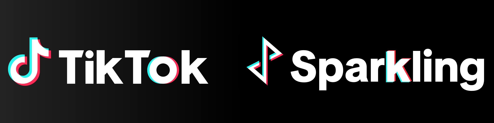

  ❇️ Sparkling is the mobile cross-platform infrastructure used by TikTok

---

## Content
- [About Sparkling](#about-sparkling)
- [Documentation](#documentation)
- [Project Layout](#project-layout)
- [How to Contribute](#how-to-contribute)
- [License](#license)

## About Sparkling
TikTok Sparkling is the mobile cross-platform development infrastructure for TikTok mobile app. Powered by [Lynx](http://lynxjs.org) & WebView.

- 📦 **Out-of-the-box Lynx development framework.** You can start a new Lynx app with Android, iOS project by Sparkling cli in minutes.
- 🔀 **Scheme Driven Navigation between mutliple pages.** You can navigate between multiple Lynx pages in your app by router.
- 🧩 **TikTok-Proven Native Abilities.** Lots of Lynx native abilities are supported, such as media, storage, etc.

## Documentation
The full documentation for Sparkling can be found in [`docs`](/docs)
- [Get Started](./docs/en/guide/get-started/create-new-app.md)
- [Integrate Sparkling into an existing app](./docs/en/guide/get-started/integrate-sparkling-into-existing-app.md)
- [API Reference](./docs/en/apis/)

## Project Layout

- [`packages/sparkling-sdk`](/packages/sparkling-sdk) Core Sparkling SDK
- [`packages/sparkling-method-sdk`](/packages/sparkling-method-sdk) Sparkling Method SDK
- [`packages/methods`](/packages/methods) Built-in Sparkling methods packages
- [`packages/sparkling-cli`](/packages/sparkling-cli) Sparkling CLI.
- [`packages/create-sparkling-app`](/packages/create-sparkling-app) App scaffolding CLI
- [`packages/sparkling-method-cli`](/packages/sparkling-method-cli) Sparkling Method tooling
- [`packages/playground`](/packages/playground) Playground app for local development
- [`template/sparkling-app-template`](/template/sparkling-app-template) App template used by `npx create sparkling-app`

## How to Contribute
### [Code of Conduct][coc]
We are devoted to ensuring a positive, inclusive, and safe environment for all contributors. Please find our [Code of Conduct][coc] for detailed information.

[coc]: CODE_OF_CONDUCT.md

### [Contributing Guide][contributing]
We welcome you to join and become a member of Sparkling Authors. It's people like you that make this project great.

Please refer to our [contributing guide][contributing] for details.

[contributing]: CONTRIBUTING.md

## License
Sparkling is Apache licensed, as found in the [`LICENSE`](/LICENSE) file.
